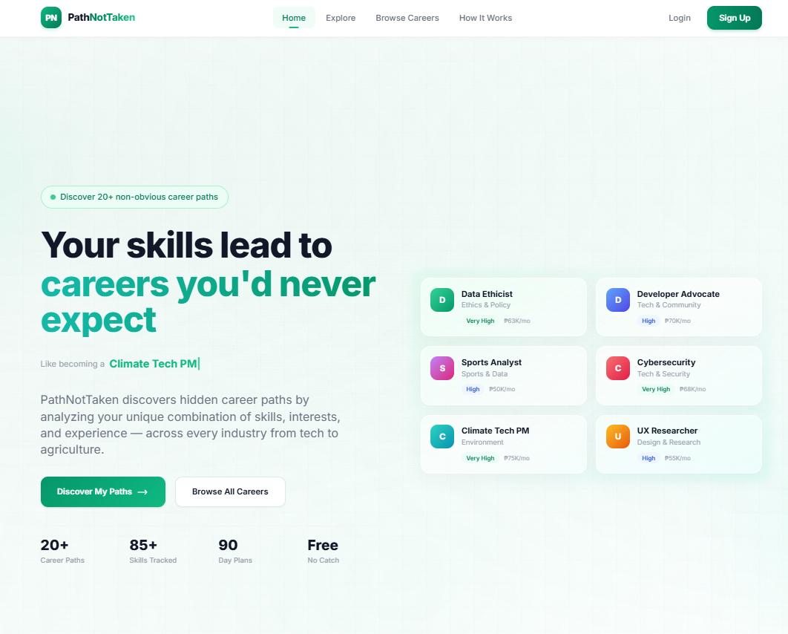

# PathNotTaken

  

**Discover career paths you never knew existed.**

PathNotTaken is an AI-powered career exploration platform that analyzes your unique combination of skills and interests to recommend non-obvious career paths across any industry — from tech to agriculture to healthcare.

Instead of matching you to job titles you already know, it uncovers hidden opportunities where your existing skills transfer in unexpected ways, then gives you a concrete 90-day roadmap to make the transition.

### Key Features

- **Skill & interest assessment** with 85+ tracked skills across every industry
- **AI-powered career recommendations** — weighted scoring, synonym matching, and semantic search
- **Skill gap analysis** with readiness scores and time-to-job-readiness estimates
- **90-day personalized roadmaps** with milestones and learning resources
- **Gamified progress tracking** — earn XP, unlock badges, and maintain streaks
- **Market intelligence** — real-time skill demand, salary premiums, and obsolescence warnings
- **Career transition analysis** with difficulty ratings, timelines, and cost breakdowns
- **Portfolio builder** with career-specific project suggestions

### Tech Stack

| Layer | Technology |
|-------|-----------|
| Frontend | Next.js 14, React, TypeScript, Tailwind CSS |
| Backend | Node.js, Express.js |
| Database | SQLite |
| AI | OpenAI API (GPT + Embeddings) |

### License

MIT
